# [CVPR2025] INP-Former 

[](https://paperswithcode.com/sota/anomaly-detection-on-mvtec-ad?p=exploring-intrinsic-normal-prototypes-within)
[](https://paperswithcode.com/sota/anomaly-detection-on-visa?p=exploring-intrinsic-normal-prototypes-within)
> The official PyTorch implementation of [Exploring Intrinsic Normal Prototypes within a Single Image for Universal Anomaly Detection](https://arxiv.org/pdf/2503.02424), CVPR 2025. This repo is created by Wei Luo.

## 🔔 Update
> - Inspired by [ADer](https://github.com/zhangzjn/ADer), we improved our testing code to accelerate the computation of metrics during the testing process, particularly AUPRO.
> - To ensure a clean runtime interface, we have addressed the "UserWarning: xFormers is not available" issue.
> - Thanks to [MinGiSa](https://github.com/MinGiSa), who provided the code for exporting to ONNX format, which can be found in the `convert_onnx.py` and `inference_onnx.py` file.

## Abstract
Anomaly detection (AD) is essential for industrial inspection, yet existing methods typically rely on ``comparing'' test images to normal references from a training set. However, variations in appearance and positioning often complicate the alignment of these references with the test image, limiting detection accuracy. We observe that most anomalies manifest as local variations, meaning that even within anomalous images, valuable normal information remains. We argue that this information is useful and may be more aligned with the anomalies since both the anomalies and the normal information originate from the same image. Therefore, rather than relying on external normality from the training set, we propose INP-Former, a novel method that extracts Intrinsic Normal Prototypes (INPs) directly from the test image. Specifically, we introduce the INP Extractor, which linearly combines normal tokens to represent INPs. We further propose an INP Coherence Loss to ensure INPs can faithfully represent normality for the testing image. These INPs then guide the INP-Guided Decoder to reconstruct only normal tokens, with reconstruction errors serving as anomaly scores. Additionally, we propose a Soft Mining Loss to prioritize hard-to-optimize samples during training. INP-Former achieves state-of-the-art performance in single-class, multi-class, and few-shot AD tasks across MVTec-AD, VisA, and Real-IAD, positioning it as a versatile and universal solution for AD. Remarkably, INP-Former also demonstrates some zero-shot AD capability.

## Overview
<p align="center">
  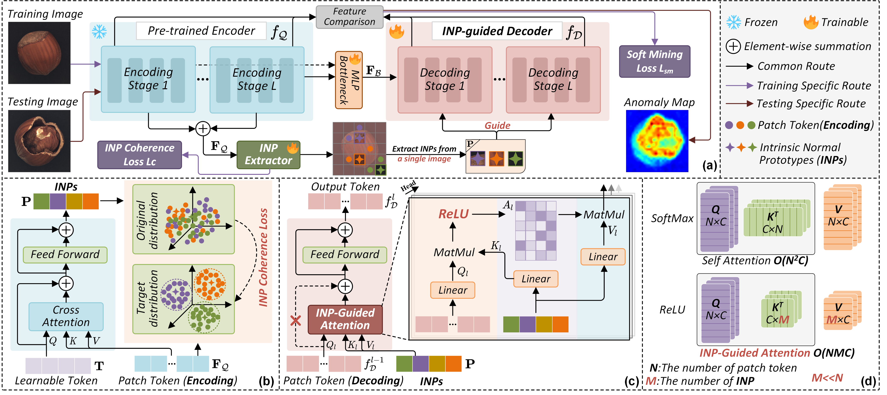
</p>

## Install Environments

Create a new conda environment and install required packages.

```
conda create -n INP python=3.8.12
conda activate INP
pip install -r requirements.txt
pip install gradio # Optional, for Zero Shot App
pip install onnx==1.15.0 onnxruntime-gpu==1.15.0 onnxsim # for export onnx file
```
Experiments are conducted on NVIDIA GeForce RTX 4090 (24GB). Same GPU and package version are recommended. 

## Prepare Datasets
Noted that `../` is the upper directory of INP-Former code. It is where we keep all the datasets by default.
You can also alter it according to your need, just remember to modify the `data_path` in the code. 

### MVTec AD

Download the MVTec-AD dataset from [URL](https://www.mvtec.com/company/research/datasets/mvtec-ad).
Unzip the file to `../mvtec_anomaly_detection`.
```
|-- mvtec_anomaly_detection
    |-- bottle
    |-- cable
    |-- capsule
    |-- ....
```


### VisA

Download the VisA dataset from [URL](https://github.com/amazon-science/spot-diff).
Unzip the file to `../VisA/`. Preprocess the dataset to `../VisA_pytorch/` in 1-class mode by their official splitting 
[code](https://github.com/amazon-science/spot-diff). `../VisA_pytorch` will be like:
```
|-- VisA_pytorch
    |-- 1cls
        |-- candle
            |-- ground_truth
            |-- test
                    |-- good
                    |-- bad
            |-- train
                    |-- good
        |-- capsules
        |-- ....
```
 
### Real-IAD
Contact the authors of Real-IAD [URL](https://realiad4ad.github.io/Real-IAD/) to get the net disk link.

Download and unzip `realiad_1024` and `realiad_jsons` in `../Real-IAD`.
`../Real-IAD` will be like:
```
|-- Real-IAD
    |-- realiad_1024
        |-- audiokack
        |-- bottle_cap
        |-- ....
    |-- realiad_jsons
        |-- realiad_jsons
        |-- realiad_jsons_sv
        |-- realiad_jsons_fuiad_0.0
        |-- ....
```
## Experiments
### Checkpoints
We provide the weights trained under multi-class, few-shot, and super multi-class settings. All downloaded weights are named as `model.pth`. Please place them in the corresponding folder, such as: `saved_results/INP-Former-Multi-Class_dataset=MVTec-AD_Encoder=dinov2reg_vit_base_14_Resize=448_Crop=392_INP_num=6`. You can run the corresponding Python script to generate the appropriate directory.

<table border="1" align="center">
  <tr>
    <th>Setting</th>
    <th>Input Size</th>
    <th>MVTec-AD</th>
    <th>VisA</th>
    <th>Real-IAD</th>
  </tr>
  <tr align="center">
    <td>Multi-Class</td>
    <td>R448<sup>2</sup>-C392<sup>2</sup></td>
    <td><a href="https://drive.google.com/file/d/1UBHNSHb-oOLWwImUtqWQI_4nku95ZgOq/view?usp=sharing">model</a></td>
    <td><a href="https://drive.google.com/file/d/1dvvYeIMBbwCPWG52fgWoP_wIgRrH1G-L/view?usp=sharing">model</a></td>
    <td><a href="https://drive.google.com/file/d/1iwMvUMyslacXgApOJ6DK0A5WXYRCH5NH/view?usp=sharing">model</a></td>
  </tr>
  <tr align="center">
    <td>Few-shot-4</td>
    <td>R448<sup>2</sup>-C392<sup>2</sup></td>
    <td><a href="https://drive.google.com/file/d/15UtpeFveG2azUQmhogoET2HifEyIKSvX/view?usp=sharing">model</a></td>
    <td><a href="https://drive.google.com/file/d/1MFZcRNwALdPPv1Wemk5_1WLq76BINdky/view?usp=sharing">model</a></td>
    <td><a href="https://drive.google.com/file/d/1vGHPDTu7IFMGBUYzZ73kWvUuCjNchJHH/view?usp=sharing">model</a></td>
  </tr>
  <tr align="center">
    <td>Few-shot-2</td>
    <td>R448<sup>2</sup>-C392<sup>2</sup></td>
    <td><a href="https://drive.google.com/file/d/1K9X8-v1bSy_mgrbVSK0w6Fx525clSTtz/view?usp=sharing">model</a></td>
    <td><a href="https://drive.google.com/file/d/1_vlO4OSQSze095ddhkkyRWCOA2IRVLia/view?usp=sharing">model</a></td>
    <td><a href="https://drive.google.com/file/d/1QOAgLkNoqX5L092IB62JBEQhtOFzqcZD/view?usp=sharing">model</a></td>
  </tr>
  <tr align="center">
    <td>Few-shot-1</td>
    <td>R448<sup>2</sup>-C392<sup>2</sup></td>
    <td><a href="https://drive.google.com/file/d/1ymAywov3JFFVzwDpcdt9Tj_iFv-mk32c/view?usp=sharing">model</a></td>
    <td><a href="https://drive.google.com/file/d/1mwpzXjLmjYLWFDx4dUF1yuErzL37K21p/view?usp=sharing">model</a></td>
    <td><a href="https://drive.google.com/file/d/1oYchgi6_lkgTFvEqq7mzKfa2lNg-3d3K/view?usp=sharing">model</a></td>
  </tr>
  <tr align="center">
    <td>Super-Multi-Class</td>
    <td>R448<sup>2</sup>-C392<sup>2</sup></td>
    <td colspan="3"><a href="https://drive.google.com/file/d/1hfzSOXlxYfKnZzvG6TmgIIxE9Bjp5XbL/view?usp=sharing">model</a></td>
  </tr>
</table>


### Options
- `dataset`: names of the datasets, MVTec-AD, VisA, or Real-IAD
- `data_path`: path to the dataset
- `encoder`: name of the pretrained encoder
- `input_size`: size of the image after resizing
- `crop_size`: size of the image after center cropping
- `INP_num`: number of INP
- `total_epochs`: number of training epochs
- `batch_size`: batch size
- `phase`: mode, train or test
- `shot`: number of samples per class in the few-shot setting
- `source_dataset`: name of the pre-trained dataset in the zero-shot setting
### Multi-Class Setting
<details>
<summary>
MVTec-AD
</summary>

#### Train:
```
python INP-Former_Multi_Class.py --dataset MVTec-AD --data_path ../mvtec_anomaly_detection --phase train
```
#### Test:
```
python INP-Former_Multi_Class.py --dataset MVTec-AD --data_path ../mvtec_anomaly_detection --phase test
```
</details>

<details>
<summary>
VisA
</summary>

#### Train:
```
python INP-Former_Multi_Class.py --dataset VisA --data_path ../VisA_pytorch/1cls --phase train
```
#### Test:
```
python INP-Former_Multi_Class.py --dataset VisA --data_path ../VisA_pytorch/1cls --phase test
```
</details>

<details>
<summary>
Real-IAD
</summary>

#### Train:
```
python INP-Former_Multi_Class.py --dataset Real-IAD --data_path ../Real-IAD --phase train
```
#### Test:
```
python INP-Former_Multi_Class.py --dataset Real-IAD --data_path ../Real-IAD --phase test
```
</details>

### Few-Shot Setting
<details>
<summary>
MVTec-AD
</summary>

#### Train:
```
python INP-Former_Few_Shot.py --dataset MVTec-AD --data_path ../mvtec_anomaly_detection --shot 4 --phase train
```
#### Test:
```
python INP-Former_Few_Shot.py --dataset MVTec-AD --data_path ../mvtec_anomaly_detection --shot 4 --phase test
```
</details>

<details>
<summary>
VisA
</summary>

#### Train:
```
python INP-Former_Few_Shot.py --dataset VisA --data_path ../VisA_pytorch/1cls --shot 4 --phase train
```
#### Test:
```
python INP-Former_Few_Shot.py --dataset VisA --data_path ../VisA_pytorch/1cls --shot 4 --phase test
```
</details>

<details>
<summary>
Real-IAD
</summary>

#### Train:
```
python INP-Former_Few_Shot.py --dataset Real-IAD --data_path ../Real-IAD --shot 4 --phase train
```
#### Test:
```
python INP-Former_Few_Shot.py --dataset Real-IAD --data_path ../Real-IAD --shot 4 --phase test
```
</details>


### Single-Class Setting
<details>
<summary>
MVTec-AD
</summary>

#### Train:
```
python INP-Former_Single_Class.py --dataset MVTec-AD --data_path ../mvtec_anomaly_detection --phase train
```
#### Test:
```
python INP-Former_Single_Class.py --dataset MVTec-AD --data_path ../mvtec_anomaly_detection --phase test
```
</details>

<details>
<summary>
VisA
</summary>

#### Train:
```
python INP-Former_Single_Class.py --dataset VisA --data_path ../VisA_pytorch/1cls --phase train
```
#### Test:
```
python INP-Former_Single_Class.py --dataset VisA --data_path ../VisA_pytorch/1cls --phase test
```
</details>

<details>
<summary>
Real-IAD
</summary>

#### Train:
```
python INP-Former_Single_Class.py --dataset Real-IAD --data_path ../Real-IAD --phase train
```
#### Test:
```
python INP-Former_Single_Class.py --dataset Real-IAD --data_path ../Real-IAD --phase test
```
</details>


### Zero-Shot Setting
<details>
<summary>
Source dataset: Real-IAD Target dataset: MVTec-AD
</summary>

```
python INP-Former_Zero_Shot.py --source_dataset Real-IAD --dataset MVTec-AD --data_path ../mvtec_anomaly_detection
```
</details>

<details>
<summary>
Source dataset: VisA Target dataset: MVTec-AD
</summary>

```
python INP-Former_Zero_Shot.py --source_dataset VisA --dataset MVTec-AD --data_path ../mvtec_anomaly_detection
```
</details>

### Super-Multi-Class Setting
<details>
<summary>
MVTec-AD+VisA+Real-IAD
</summary>

#### Train:
```
python INP-Former_Super_Multi_Class.py --mvtec_data_path ../mvtec_anomaly_detection --visa_data_path ../VisA_pytorch/1cls --real_iad_data_path ../Real-IAD --phase train 
```
#### Test:
```
python INP-Former_Super_Multi_Class.py --mvtec_data_path ../mvtec_anomaly_detection --visa_data_path ../VisA_pytorch/1cls --real_iad_data_path ../Real-IAD --phase test 
```
</details>


## Results
Similar to [Dinomaly](https://github.com/guojiajeremy/Dinomaly), our INP-Former may exhibit slight inaccuracies when using the GT mask, as discussed in this [issue](https://github.com/guojiajeremy/Dinomaly/issues/14). We have now addressed this issue, so the pixel-level AP and F1-max results obtained from the current code may be slightly lower than the metrics reported in the paper.
### Multi-Class Setting
<p align="center">
  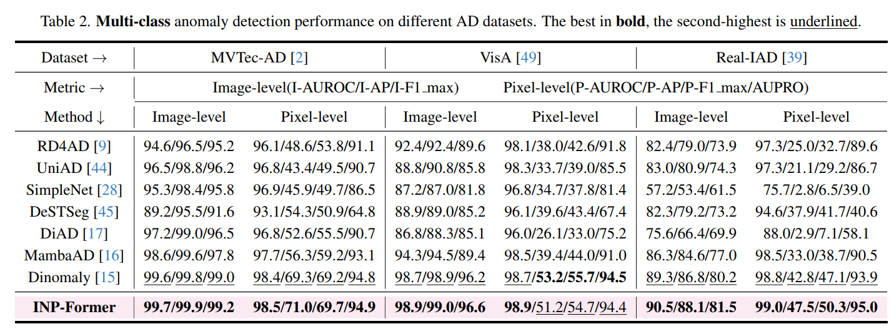
</p>
<p align="center">
  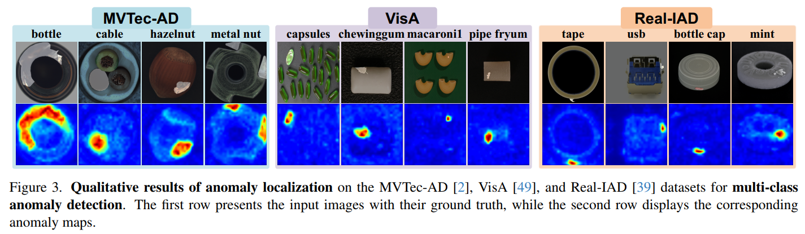
</p>

### Few-Shot Setting
<p align="center">
  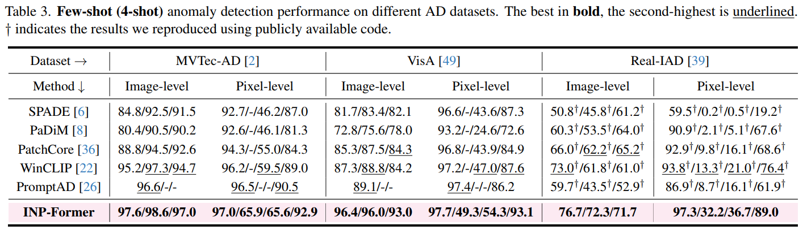
</p>
<p align="center">
  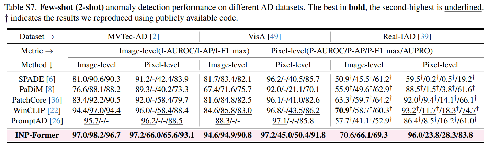
</p>
<p align="center">
  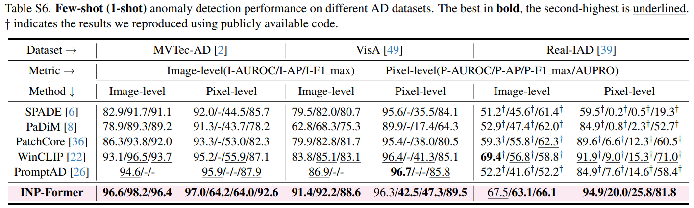
</p>

### Single-Class Setting
<p align="center">
  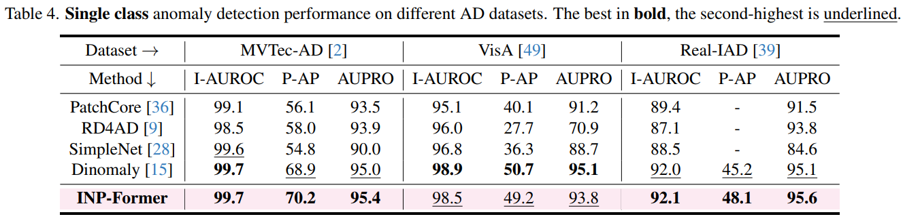
</p>

### Zero-Shot Setting
<p align="center">
  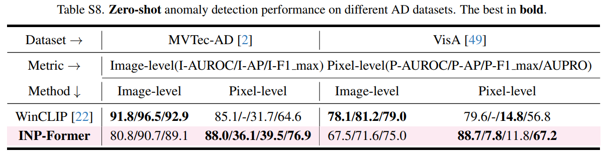
</p>

<p align="center">
  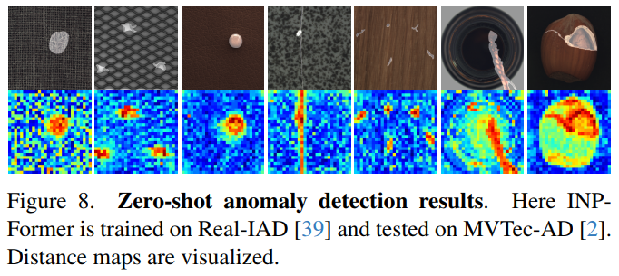
</p>


### Super-Multi-Class Setting
<p align="center">
  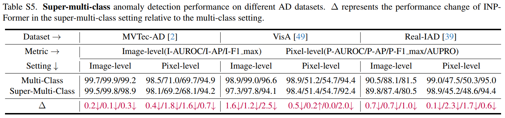
</p>

## Zero-Shot App
We have also developed an App for zero-shot anomaly detection. The pre-trained weights are trained on the Real-AD or VisA dataset under a multi-class setting and applied to zero-shot anomaly detection on the MVTec-AD dataset.
<details>
<summary>
Run App
</summary>

```
python Zero_Shot_App.py
```
</details>

To get started quickly, you can also explore our [Online App](https://huggingface.co/spaces/luoweibetter/INP-Former).
<p align="center">
  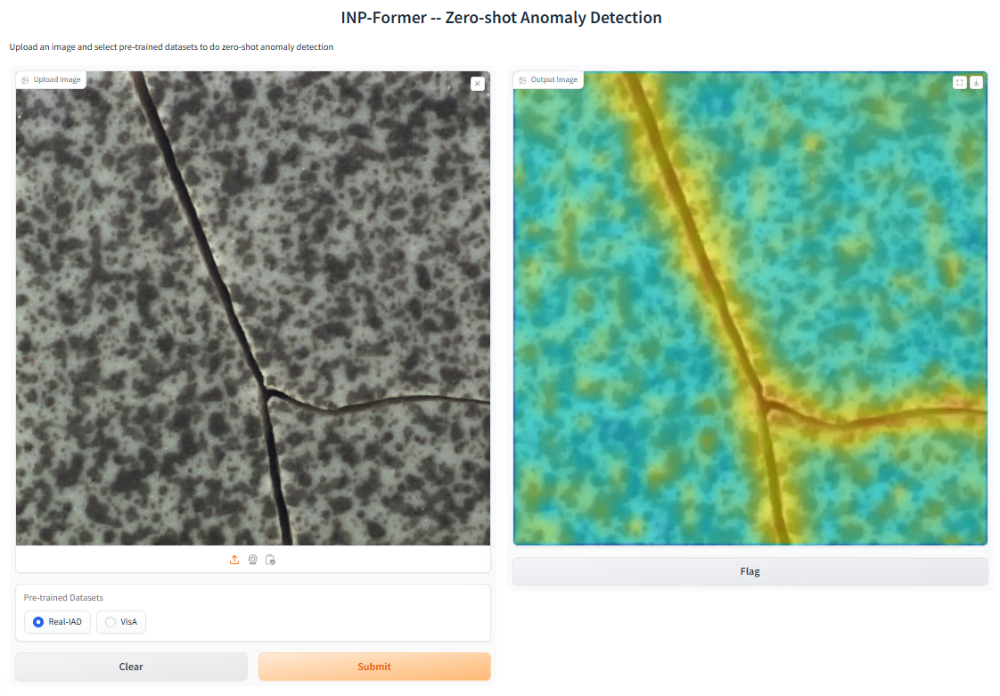
</p>

## Acknowledgements
We sincerely appreciate [Dinomaly](https://github.com/guojiajeremy/Dinomaly) for its concise, effective, and easy-to-follow approach. We also thank [Reg-AD](https://github.com/MediaBrain-SJTU/RegAD), as the data augmentation techniques used in our few-shot setting were inspired by it. We further acknowledge [OneNIP](https://github.com/gaobb/OneNIP) for inspiring our super-multi-class experiments. Additionally, we would like to thank [AdaCLIP](https://github.com/caoyunkang/AdaCLIP) for providing inspiration for our zero-shot App.
## Citation
If our work is helpful for your research, please consider citing:
```
@article{luo2025exploring,
  title={Exploring Intrinsic Normal Prototypes within a Single Image for Universal Anomaly Detection},
  author={Luo, Wei and Cao, Yunkang and Yao, Haiming and Zhang, Xiaotian and Lou, Jianan and Cheng, Yuqi and Shen, Weiming and Yu, Wenyong},
  journal={arXiv preprint arXiv:2503.02424},
  year={2025}
}
```
## Contact
If you have any questions about our work, please do not hesitate to contact [luow23@mails.tsinghua.edu.cn](mailto:luow23@mails.tsinghua.edu.cn).
